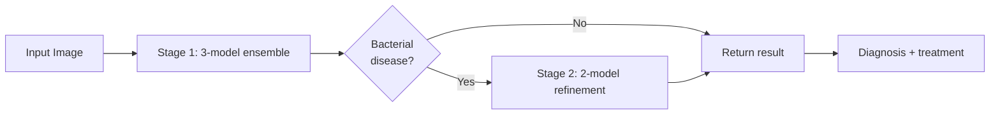

# Rice Leaf Disease Detection

A two-stage deep learning system for detecting rice leaf diseases from images, deployed as a web application.

**Live Demo:** https://undebuggedbit-rice-leaf-disease-detector.hf.space/

[](https://www.python.org/downloads/)
[](https://pytorch.org/)
[](https://flask.palletsprojects.com/)
[](https://undebuggedbit-rice-leaf-disease-detector.hf.space/)
[](LICENSE)

---

## Why This Project

Rice is the staple crop for over half the world's population. India alone produces ~130 million tonnes of rice annually, and an estimated **10–15% of yield is lost each year to leaf diseases** such as bacterial blight, blast, and brown spot. Early detection by smallholder farmers is the bottleneck — most cannot afford expert visits or lab diagnosis, and visually similar diseases require different treatments.

This project explores whether a lightweight, free-to-use web tool can give a farmer or field officer a reliable preliminary diagnosis from a single phone photo of a leaf, with treatment guidance — in under 2 seconds.

---

## What It Does

Upload a photo of a rice leaf → the system returns a disease label, a confidence score, and a treatment recommendation.

The model handles 7 output classes:

| Class | Type | Treatment-relevant |
|---|---|---|
| Bacterial Leaf Blight | Bacterial | Yes — copper-based bactericides |
| Brown Spot | Fungal | Yes — fungicide + potassium management |
| Leaf Blast | Fungal | Yes — tricyclazole-based fungicide |
| Leaf Scald | Fungal | Yes — resistant varieties + fungicide |
| Narrow Brown Spot | Fungal | Yes — fungicide application |
| Healthy Leaf | — | None needed |
| Not a Rice Leaf | — | Rejects out-of-distribution input |

---

## Approach: Two-Stage Ensemble

A single classifier struggled to distinguish visually similar bacterial diseases. I split the problem:

**Stage 1 — Broad triage (7-class classification)**
A 3-model ensemble (EfficientNet-B3, DenseNet-121, MobileNetV3) majority-votes on the disease family. Fast, accurate enough to route most cases directly to a final answer.

**Stage 2 — Bacterial disease refinement (5-class classification)**
If Stage 1 flags a bacterial disease, a 2-model ensemble (ViT-Base, ConvNeXt-Tiny) re-classifies among the bacterial subtypes for higher precision. Only invoked when needed, keeping average latency low.



### Why ensembles instead of a single bigger model?
A single ViT-Base achieves comparable accuracy but takes ~3x longer per inference. The ensemble lets me combine a fast first-pass with a precise refinement only on the hard cases, optimizing for average latency, not peak accuracy.

### What I optimized
- **Initial design used 6 models. Final design uses 5.** Removing the weakest contributor (a redundant ResNet variant) reduced inference time by ~16% and *improved* combined accuracy by 0.91%, because the dropped model was adding correlated errors rather than diverse predictions.

---

## Results

| Metric | Stage 1 (7-class) | Stage 2 (5-class) | Combined Pipeline |
|---|---|---|---|
| Accuracy | 96.68% | 98.18% | **98.2%** |
| Precision | 96.5% | 98.3% | **98.1%** |
| Recall | 96.4% | 98.2% | **98.0%** |
| F1-Score | 96.4% | 98.2% | **98.1%** |
| Avg. inference time | 0.8s | 1.1s | **<2s end-to-end** |

Metrics computed on a held-out test set (15% of total data, stratified by class).

---

## Dataset

- **Source:** Public rice leaf disease datasets from Kaggle and the UCI ML Repository, combined and deduplicated.
- **Total images:** ~5,400 across 7 classes after cleaning.
- **Splits:** 70% train / 15% validation / 15% test, stratified.
- **Preprocessing:** Resize to 224×224, normalize with ImageNet statistics.
- **Augmentation (train only):** Horizontal flip, rotation (±15°), color jitter, random erasing.
- **Class imbalance:** Healthy and "Not a rice leaf" classes were under-represented; addressed via weighted sampling during training.

---

## Limitations

Honest about what this system can and cannot do:

- **Trained on curated, well-lit dataset images.** Real field photos with shadows, dirt, multiple leaves, or blurry focus will degrade performance — this hasn't been quantified yet.
- **Only 5 disease classes covered.** Real rice cultivation has 20+ diseases, plus nutrient deficiencies and pest damage that can visually resemble disease.
- **No regional or varietal awareness.** Symptoms can present differently across rice cultivars and climates; this model treats them all as one distribution.
- **Treatment recommendations are generic.** They do not account for local resistance patterns, organic vs. conventional farming, or regional pesticide regulations.
- **Not a substitute for an agronomist.** Intended as a triage tool, not a diagnostic authority.

---

## Tech Stack

- **Models:** PyTorch (EfficientNet, DenseNet, MobileNet, ViT, ConvNeXt — all initialized from ImageNet weights and fine-tuned)
- **Backend:** Flask + REST API
- **Deployment:** Docker container on Hugging Face Spaces
- **Frontend:** HTML / CSS / vanilla JS with drag-and-drop upload

---

## API Usage

### POST /predict

```bash
curl -X POST \
  -F "file=@rice_leaf.jpg" \
  https://undebuggedbit-rice-leaf-disease-detector.hf.space/predict
```

Response:

```json
{
  "success": true,
  "diagnosis": "Bacterial Leaf Blight",
  "confidence": "98.45%",
  "severity": "High",
  "recommendation": "Use resistant varieties and apply copper-based bactericides.",
  "details": {
    "stage1_prediction": "Bacterial Leaf Blight",
    "stage1_confidence": "99.12%",
    "stage2_used": true,
    "stage2_prediction": "Bacterial Leaf Blight",
    "stage2_confidence": "98.45%",
    "processing_time": "1.87s"
  }
}
```

### GET /health

Returns service health and model load status. See `app.py` for the full schema.

---

## Local Setup

```bash
# Clone
git clone https://github.com/AnuragPandey19/Rice-Disease-Detector
cd Rice-Disease-Detector

# Virtual environment
python -m venv venv
source venv/bin/activate          # macOS/Linux
# venv\Scripts\activate           # Windows

# Install
pip install -r requirements.txt

# Run
python app.py
# → http://localhost:7860
```

Model weights must be placed under `saved_models/stage1_models/` and `saved_models/stage2_models/`. See `SETUP_GUIDE.md` for the full list.

### Docker

```bash
docker build -t rice-leaf-detection .
docker run -p 7860:7860 rice-leaf-detection
```

---

## Project Structure

```
.
├── app.py                       # Flask application + inference pipeline
├── requirements.txt
├── Dockerfile
├── SETUP_GUIDE.md
├── templates/index.html         # Web UI
├── static/                      # CSS, JS
├── saved_models/
│   ├── stage1_models/           # EfficientNet, DenseNet, MobileNet weights
│   └── stage2_models/           # ViT, ConvNeXt weights
├── train/                       # Stage 1 training notebooks
├── train_stage2/                # Stage 2 training notebooks
└── validation/                  # Evaluation scripts and confusion matrices
```

---

## What's Next

Realistic short-term work:

- [ ] Evaluate on real field photos (not just curated datasets) and report the accuracy gap
- [ ] Add Grad-CAM visualizations so users can see which leaf regions influenced the prediction
- [ ] Quantize models with ONNX to enable on-device (mobile) inference
- [ ] Expand to additional regional diseases beyond the current 7 classes

---

## Author

**Anurag Pandey**
B.Tech CSE (AI/ML), UPES Dehradun

- GitHub: [@AnuragPandey19](https://github.com/AnuragPandey19)
- LinkedIn: [anurag-pandey-154259280](https://www.linkedin.com/in/anurag-pandey-154259280/)
- Email: Anurag.120453@stu.upes.ac.in

---

## License

MIT — see [LICENSE](LICENSE).
