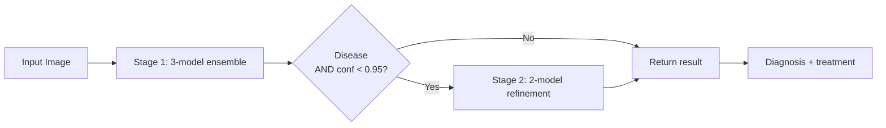

# Rice Leaf Disease Detection

A two-stage deep learning system for detecting rice leaf diseases from images, deployed as a web application.

**Live Demo:** https://undebuggedbit-rice-leaf-disease-detector.hf.space/

[](https://www.python.org/downloads/)
[](https://pytorch.org/)
[](https://flask.palletsprojects.com/)
[](https://undebuggedbit-rice-leaf-disease-detector.hf.space/)
[](LICENSE)

---

## Why This Project

Rice is the staple crop for over half the world's population. India alone produces ~130 million tonnes of rice annually, and an estimated **10–15% of yield is lost each year to leaf diseases** such as bacterial blight, blast, and brown spot. Early detection by smallholder farmers is the bottleneck — most cannot afford expert visits or lab diagnosis, and visually similar diseases require different treatments.

This project explores whether a lightweight, free-to-use web tool can give a farmer or field officer a reliable preliminary diagnosis from a single phone photo of a leaf, with treatment guidance — in under 2 seconds.

---

## What It Does

Upload a photo of a rice leaf → the system returns a disease label, a confidence score, and a treatment recommendation.

The model handles 7 output classes:

| Class | Type | Treatment-relevant |
|---|---|---|
| Bacterial Leaf Blight | Bacterial | Yes — copper-based bactericides, resistant varieties, field drainage |
| Brown Spot | Fungal | Yes — fungicide application, disease-free seeds, nutrition management |
| Leaf Blast | Fungal | Yes — resistant varieties, systemic fungicides, reduce nitrogen |
| Leaf Scald | Fungal | Yes — resistant varieties, remove infected plants, copper bactericides |
| Narrow Brown Spot | Fungal | Yes — improve soil fertility, targeted fungicide |
| Healthy Leaf | — | None needed |
| Not a Rice Leaf | — | Rejects out-of-distribution input |

---

## Approach: Two-Stage Ensemble

A single classifier struggled to distinguish visually similar diseases. I split the problem:

**Stage 1 — Broad triage (7-class classification)**
A 3-model ensemble (EfficientNet-B3, DenseNet-121, MobileNetV3-Large) soft-votes (averaged softmax) on the disease label. Fast, accurate enough to route most cases directly to a final answer.

**Stage 2 — Disease refinement (5-class classification)**
If Stage 1 predicts any of the 5 disease classes **and** Stage 1 confidence is below 0.95, a 2-model ensemble (ViT-Base + ConvNeXt-Tiny) re-classifies among the 5 disease subtypes for higher precision. Stage 2 is skipped on healthy leaves, off-distribution inputs, and high-confidence disease predictions, keeping average latency low.



Final confidence is computed as `stage1_conf * stage2_conf` (multiplicative) when Stage 2 runs, otherwise just `stage1_conf`.

### Why ensembles instead of a single bigger model?
A single ViT-Base achieves comparable accuracy but takes ~3x longer per inference. The ensemble lets me combine a fast first-pass with a precise refinement only on the hard cases, optimizing for average latency, not peak accuracy.

### What I optimized
- **Initial design used 6 models. Final design uses 5.** Removing the weakest Stage 2 contributor — **EfficientNetV2-S** (94.09% standalone) — reduced inference time by ~16% and *improved* Stage 2 ensemble accuracy by 0.91% (97.27% → 98.18%), because the dropped model was adding correlated errors rather than diverse predictions.

---

## Results

Measured on the validation set (held out by folder, not random split):

| Metric | Stage 1 (7-class) | Stage 2 (5-class) |
|---|---|---|
| Ensemble accuracy | **96.68%** | **98.18%** |
| Avg. ensemble confidence | 87.71% | 96.12% |

**Per-class accuracy (Stage 2, final 2-model setup):**

| Class | Accuracy |
|---|---|
| Bacterial Leaf Blight | 100.00% |
| Brown Spot | 96.59% |
| Leaf Blast | 94.32% (+5.68% vs. original 3-model setup) |
| Leaf Scald | 100.00% |
| Narrow Brown Spot | 100.00% |

> Note: Latency was not formally benchmarked. The "<2s end-to-end" claim is anecdotal from the Hugging Face Spaces demo on free-tier CPU; results will vary by hardware.

---

## Dataset

- **Source:** Public rice leaf disease datasets from Kaggle and the UCI ML Repository, combined and deduplicated.
- **Stage 1 — train:** 2,519 images across 7 classes (350 each of 6 disease/healthy classes; 420 not-a-rice-leaf).
- **Stage 1 — validation:** 634 images (88 each of 6 classes; 106 not-a-rice-leaf).
- **Stage 2 — train:** 1,750 disease images (350 × 5 disease classes).
- **Stage 2 — validation:** 440 disease images (88 × 5).
- **Split:** Train/validation only (~80/20). No separate held-out test set; reported metrics are validation accuracy.
- **Preprocessing:** Resize to 224×224, normalize with ImageNet statistics.
- **Augmentation (train only):** Horizontal flip, vertical flip, rotation (±30° for Stage 1, ±45° for Stage 2), color jitter, random affine translation/scaling, random perspective.
- **Class imbalance:** Mild. Stage 1 was trained with **focal loss (α=1, γ=2)** to put weight on harder disease boundaries.

---

## Limitations

Honest about what this system can and cannot do:

- **Trained on curated, well-lit dataset images.** Real field photos with shadows, dirt, multiple leaves, or blurry focus will degrade performance — this hasn't been quantified yet.
- **Only 5 disease classes covered.** Real rice cultivation has 20+ diseases, plus nutrient deficiencies and pest damage that can visually resemble disease.
- **No regional or varietal awareness.** Symptoms can present differently across rice cultivars and climates; this model treats them all as one distribution.
- **Treatment recommendations are generic.** They do not account for local resistance patterns, organic vs. conventional farming, or regional pesticide regulations.
- **Confidence calibration not measured.** The 0.95 routing threshold is heuristic, not derived from a reliability diagram.
- **No held-out test set.** Reported metrics are on the validation set used for model selection; true generalization could be lower.
- **Not a substitute for an agronomist.** Intended as a triage tool, not a diagnostic authority.

---

## Tech Stack

- **Models:** PyTorch 2.5 (EfficientNet-B3, DenseNet-121, MobileNetV3-Large, ViT-Base, ConvNeXt-Tiny — all initialized from ImageNet weights and fine-tuned with partial-freeze)
- **Backend:** Flask 3 + Flask-CORS, single Gunicorn worker
- **Deployment:** Docker container (`python:3.10-slim`) on Hugging Face Spaces
- **Frontend:** HTML / CSS / vanilla JS with drag-and-drop upload

---

## API Usage

### POST /predict

```bash
curl -X POST \
  -F "file=@rice_leaf.jpg" \
  https://undebuggedbit-rice-leaf-disease-detector.hf.space/predict
```

Example response:

```json
{
  "success": true,
  "diagnosis": "Bacterial Leaf Blight",
  "confidence": "97.59%",
  "severity": "High",
  "description": "A serious bacterial disease causing water-soaked lesions that turn yellow or white.",
  "recommendation": "Use resistant varieties, apply copper-based bactericides, ensure proper field drainage.",
  "icon": "🦠",
  "stage2_used": true,
  "timestamp": "2025-11-16 10:23:45",
  "details": {
    "stage1_prediction": "Bacterial Leaf Blight",
    "stage1_confidence": "99.12%",
    "stage2_prediction": "bacterial_leaf_blight",
    "models_used": 5
  }
}
```

`confidence` is the combined (multiplicative) confidence when Stage 2 runs.

### GET /health

Returns service health and model load status:
```json
{ "status": "healthy", "model_loaded": true, "device": "cpu", "timestamp": "..." }
```

---

## Local Setup

```bash
# Clone
git clone https://github.com/AnuragPandey19/Rice-Disease-Detector
cd Rice-Disease-Detector

# Virtual environment
python -m venv venv
source venv/bin/activate          # macOS/Linux
# venv\Scripts\activate           # Windows

# Install
pip install -r requirements.txt

# Run
python app.py
# → http://localhost:7860
```

Model weights must be placed under `saved_models/stage1_models/` and `saved_models/stage2_models/`. See `SETUP_GUIDE.md` for the full list.

### Docker

```bash
docker build -t rice-leaf-detection .
docker run -p 7860:7860 rice-leaf-detection
```

---

## Project Structure

```
.
├── app.py                       # Flask app + two-stage ensemble inference pipeline
├── model.ipynb                  # Training notebook (Stage 1 + Stage 2)
├── requirements.txt
├── Dockerfile
├── SETUP_GUIDE.md
├── templates/index.html         # Web UI
├── static/                      # CSS, JS
├── train/                       # Stage 1 training images (7 classes)
├── validation/                  # Stage 1 validation images
├── train_stage2/                # Stage 2 training images (5 disease classes)
├── validation_stage2/           # Stage 2 validation images
├── saved_models/
│   ├── stage1_models/           # EfficientNet, DenseNet, MobileNet weights + confusion matrices
│   ├── stage2_models/           # ViT, ConvNeXt weights + confusion matrices
│   ├── ensemble_config.json
│   └── training_summary_report.txt
└── production_deployment/       # Production config + deployment package
```

---

## What's Next

Realistic short-term work:

- [ ] Evaluate on real field photos (not just curated datasets) and report the accuracy gap
- [ ] Add Grad-CAM visualizations so users can see which leaf regions influenced the prediction
- [ ] Quantize models with ONNX to enable on-device (mobile) inference
- [ ] Run confidence-calibration analysis (reliability diagrams, ECE) and re-tune the 0.95 routing threshold
- [ ] Expand to additional regional diseases beyond the current 5

---

## Author

**Anurag Pandey**
B.Tech CSE (AI/ML), UPES Dehradun

- GitHub: [@AnuragPandey19](https://github.com/AnuragPandey19)
- LinkedIn: [anurag-pandey-154259280](https://www.linkedin.com/in/anurag-pandey-154259280/)
- Email: Anurag.120453@stu.upes.ac.in

---

## License

MIT — see [LICENSE](LICENSE).
