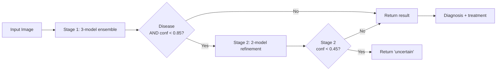

# Rice Leaf Disease Detection

A two-stage deep learning system for detecting rice leaf diseases from images, deployed as a web application.

**Live Demo:** https://undebuggedbit-rice-leaf-disease-detector.hf.space/

[](https://www.python.org/downloads/)
[](https://pytorch.org/)
[](https://flask.palletsprojects.com/)
[](https://undebuggedbit-rice-leaf-disease-detector.hf.space/)
[](LICENSE)

---

## Why This Project

Rice is the staple crop for over half the world's population. India alone produces ~130 million tonnes of rice annually, and an estimated **10–15% of yield is lost each year to leaf diseases** such as bacterial blight, blast, and brown spot. Early detection by smallholder farmers is the bottleneck — most cannot afford expert visits or lab diagnosis, and visually similar diseases require different treatments.

This project explores whether a lightweight, free-to-use web tool can give a farmer or field officer a reliable preliminary diagnosis from a single phone photo of a leaf, with treatment guidance — in under 2 seconds.

---

## What It Does

Upload a photo of a rice leaf → the system returns a disease label, a confidence score, and **what to do about it**.

A label on its own is not much use to someone standing in a field. Every diagnosis comes back with:

- **What to look for** — the symptoms that distinguish this disease from the ones it is confused with
- **Do this first** — the actions worth taking today, ordered
- **Cultural control** — nutrition, water and variety choices, listed before chemicals because for most of these diseases they do more
- **Chemical options** — active ingredients by name, with the caveats that apply
- **Prevention** — what to change before next season
- **When to call someone** — the specific signs that mean this needs a human
- **Where to read more** — IRRI Rice Knowledge Bank fact sheets, and helpline numbers

The same guidance is browsable as a **disease library** without uploading anything, and both come from one source in `app.py`, so they cannot drift apart.

**No spray rates or brand names.** Active ingredients are named; doses are not. The correct rate depends on formulation, growth stage, local resistance and national registration — publishing a number here would be advice this project cannot stand behind.

The model handles 7 output classes:

| Class | Type | Primary control |
|---|---|---|
| Bacterial Leaf Blight | Bacterial | Resistant varieties, drainage, stop nitrogen — bactericides are largely ineffective |
| Brown Spot | Fungal | Correct potassium and silicon first; it is usually a soil problem |
| Leaf Blast | Fungal | Stop nitrogen, keep flooded, protect the neck at booting |
| Leaf Scald | Fungal | Reduce nitrogen, open the canopy, clear debris |
| Narrow Brown Spot | Fungal | Potassium, resistant varieties; boot-stage fungicide only if it reaches the sheath |
| Healthy Leaf | — | Monitoring guidance |
| Not a Rice Leaf | — | Rejects out-of-distribution input |

---

## Approach: Two-Stage Ensemble

A single classifier struggled to distinguish visually similar diseases. I split the problem:

**Stage 1 — Broad triage (7-class classification)**
A 3-model ensemble (EfficientNet-B3, DenseNet-121, MobileNetV3-Large) soft-votes (averaged softmax) on the disease label. Fast, accurate enough to route most cases directly to a final answer.

**Stage 2 — Disease refinement (5-class classification)**
If Stage 1 predicts any of the 5 disease classes **and** Stage 1 confidence is below 0.85, a 2-model ensemble (ViT-Base + ConvNeXt-Tiny) re-classifies among the 5 disease subtypes for higher precision. Stage 2 is skipped on healthy leaves, off-distribution inputs, and high-confidence disease predictions, keeping average latency low.



When Stage 2 runs, the reported confidence is **Stage 2's own** — the Stage 1 value is exposed separately in `details`. The original multiplied the two, which is not a joint probability (the models are not independent, and neither is calibrated) and was lowest precisely when Stage 2 had been most useful.

If Stage 2's own confidence falls below **0.45**, the API returns `uncertain` rather than forcing a disease label. Stage 2's output space excludes `healthy` and `not_rice_leaf`, so it cannot correct a Stage 1 false positive — only relabel it — and it is invoked exactly when Stage 1 was least sure.

### Calibration: the confidence figure understates the model

A reliability study on the validation set found the ensemble is systematically **under**-confident — unusual, since deep networks are normally the opposite. Every confidence bin is pessimistic, by up to 30 points:

| Model says | Actually correct |
|---|---|
| 65% | 94.4% |
| 75% | 100% |
| 85% | 100% |

**ECE 11.98%.** Averaging three softmax outputs drags the maximum down whenever the members disagree slightly, even though the argmax stays right. Treat the displayed percentage as a rough ordering, not a probability.

This is why the Stage 2 routing threshold is **0.85 rather than 0.95**: an under-confident model rarely cleared 0.95, so Stage 2 was running on more than half of all requests, and in the 0.80–0.90 band Stage 1 was already 100% accurate — routing those on could only make them worse.

Reproduce with `python v2/scripts/08_calibration.py`.

### Why ensembles instead of a single bigger model?
A single ViT-Base achieves comparable accuracy but takes ~3x longer per inference. The ensemble lets me combine a fast first-pass with a precise refinement only on the hard cases, optimizing for average latency, not peak accuracy.

### What I optimized
- **Initial design used 6 models. Final design uses 5.** Removing the weakest Stage 2 contributor — **EfficientNetV2-S** (94.09% standalone) — reduced inference time by ~16% and *improved* Stage 2 ensemble accuracy by 0.91% (97.27% → 98.18%), because the dropped model was adding correlated errors rather than diverse predictions.

  Both of those figures are v1 **validation** accuracy, and the model was selected on the same data that produced them — so the 0.91% gain is not independently verified. The architecture decision still stands (two diverse models beat three correlated ones), but the margin should be read as indicative, not measured. The current Stage 2 numbers are in [Results](#results).

---

## Results

Both stages were rebuilt in August 2026 — Stage 1 after a background shortcut was found in the original data (see [the post-mortem](#post-mortem-the-original-model-read-the-background)), Stage 2 because it had no held-out test set and had never seen a field photograph. Every number below was measured **once** on a held-out test set that was never used for training or model selection.

| Metric | Value |
|---|---|
| Stage 1 ensemble accuracy (test set, 656 images) | **94.51%** |
| — on studio images (isolated leaf, plain paper) | 96.52% |
| — on **real field photographs** | **81.67%** |
| Stage 2 ensemble accuracy (test set, 425 images) | **95.29%** |
| — on studio images | 97.61% |
| — on **real field photographs** | **86.67%** |

Stage 2 was previously reported at 98.18%. That figure was validation accuracy on the same data used to choose the models, so it was never a measure of generalisation; 95.29% is the honest replacement, on a set that includes field photographs. The drop is the correction, not a regression.

Stage 2 outperforms Stage 1 on field photographs (86.67% vs 81.67%), which locates the remaining weakness: the bottleneck is Stage 1's seven-way decision, not the disease refinement that follows it.

**Per-class, Stage 1 test set:**

| Class | Precision | Recall | F1 | Support |
|---|---|---|---|---|
| Bacterial Leaf Blight | 96.70% | 90.72% | 93.62% | 97 |
| Brown Spot | 85.44% | 90.72% | 88.00% | 97 |
| Healthy | 92.16% | 96.91% | 94.47% | 97 |
| Leaf Blast | 91.11% | 84.54% | 87.70% | 97 |
| Leaf Scald | 97.10% | 100.00% | 98.53% | 67 |
| Narrow Brown Spot | 100.00% | 100.00% | 100.00% | 67 |
| **Not a Rice Leaf** | **100.00%** | **100.00%** | **100.00%** | 134 |

**The row that matters most is the last one.** Zero false rejections: not one rice image in the test set was misclassified as "not a rice leaf", and nothing else was misclassified into it. That was the defining failure of the original model.

Every remaining error is disease-vs-disease — brown spot confused with leaf blast, and so on. Those are genuinely hard agronomic distinctions. Rejecting a rice leaf as "not a leaf" was not.

### Before and after

| | Original (Nov 2025) | Current (Aug 2026) |
|---|---|---|
| Headline number | 96.68% validation | 94.51% held-out test |
| Held-out test set | none — validation reused for model selection | yes, evaluated once |
| Field-photo accuracy | never measured | 81.67% |
| Real field photos (`t1`–`t3`) | rejected as not-a-rice-leaf at 88–99% | correctly identified as rice, 3/3 |
| False rejections on test set | — | 0 |

The headline number went **down** by 2.17 points. That is the point: the old figure was inflated by a shortcut, and the new one describes something real.

> Latency was not formally benchmarked. Any "<2s" claim is anecdotal from the Hugging Face Spaces demo on free-tier CPU.

---

## Post-Mortem: The Original Model Read the Background

The original model reported 96.68% accuracy and could not classify a photograph of a rice leaf. Documenting the whole diagnosis rather than quietly patching it.

**Symptom.** Real field photographs of diseased rice leaves were confidently rejected as `not_rice_leaf`, despite 96.68% validation accuracy.

**Cause.** The dataset has a structural flaw:

- All 2,100 images across the 6 rice classes are a **single isolated leaf photographed flat against plain light paper** (white / beige / grey).
- The 420 `not_rice_leaf` images are **stock photography of busy natural scenes** — gardens, pets, food, landscapes, vehicles.

Background statistics alone separate those two groups perfectly, so the models never needed to learn leaf morphology — and didn't.

**Experiment.** Two directions, reproducible via `diagnostics/test_background.py`:

*A — strip the background out of a failing field photo:*

| Input | Prediction | P(not_rice_leaf) |
|---|---|---|
| Full field photo | `not_rice_leaf` | **99.08%** |
| Cropped to leaf cluster | `brown_spot` | 0.65% |
| Cropped tighter | `brown_spot` | 0.31% |
| Single blade, no background | `brown_spot` | 1.12% |

*B — the reverse. Identical leaf pixels; only the background changes:*

| Input | Prediction | Confidence |
|---|---|---|
| Training leaf, untouched | `bacterial_leaf_blight` | 99.87% |
| **Same leaf composited onto a busy background** | `not_rice_leaf` | **84.21%** |
| **Same leaf composited onto a plain background** | `bacterial_leaf_blight` | 79.42% |

Same leaf pixels in both rows of the pair. Swapping only the background flips the verdict. The `not_rice_leaf` decision is driven by scene complexity, not by whether a rice leaf is present.

**Implication.** The 96.68% figure was real but narrow: it measured the ability to distinguish *plain-paper studio photographs* from *busy stock photographs*. It was not field accuracy.

**Root cause in the data.** Picture the training set as a 2×2 grid:

| | Plain background | Busy background |
|---|---|---|
| **Rice leaf** | 2,100 studio images | **empty** |
| **Not rice** | **empty** | 420 stock photos |

Only the diagonal was populated, so background predicted the label perfectly. A sample of 36 `not_rice_leaf` images contained houses, phones, laptops, cars, dogs, cats and office furniture — and not a single leaf close-up. The network never had to learn what a rice leaf looks like.

### The fix

Both empty cells had to be filled:

- **Hard negatives** — 350 non-rice leaves (14 species from PlantVillage: maize, tomato, potato, grape, soybean…) photographed on plain backgrounds, labelled `not_rice_leaf`. This kills *"plain background ⇒ rice"*.
- **Field photographs** — 800 real paddy-field images from the [Paddy Doctor dataset](https://paddydoc.github.io/dataset/) (Tirunelveli, Tamil Nadu, smartphone-captured), merged into the disease classes. This kills *"busy background ⇒ not rice"*.

Hard negatives alone would have fixed only half of it. All images were re-encoded to a common 800×800 JPEG so that resolution could not become the next shortcut.

Stage 1 was then retrained. Stage 2 was deliberately left alone at first — it never had a `not_rice_leaf` class and so could not have learned the shortcut. It was rebuilt a day later for a different reason: it had no held-out test set, and it had only ever trained on studio images, so nobody knew what it cost when Stage 1 routed a field photograph to it. The answer turned out to be less than expected — 86.67% on field photographs, better than Stage 1 manages.

### Result

| Test | Original | Rebuilt |
|---|---|---|
| `t1`, `t2`, `t3` (real field photos) | rejected, 88–99% confident | **classified as rice, 3/3** |
| False rejections on held-out test set | — | **0 of 656** |
| Field-photo accuracy | never measured | 81.67% |

**What is still not fixed.** A deliberately hostile probe — pasting a studio leaf onto a stock photo of a dog or a car — still flips to `not_rice_leaf` in 7 of 8 trials. That composite is unlike anything in the training data and arguably has no correct answer, but the tendency is real and worth naming.

**Reproduce:**

```bash
python diagnostics/diagnose.py            # checkpoint integrity, per-model votes
python diagnostics/test_background.py     # the original two-direction experiment
python v2/scripts/05_shortcut_check.py    # the hostile probe, on the rebuilt model
python v2/scripts/06_test_real_photos.py  # original vs rebuilt on real photos
python v2/scripts/07_confusion.py         # confusion matrix, precision/recall by source
python diagnostics/test_pipeline.py       # the full pipeline, exactly what the API returns
python diagnostics/compare_stage2.py      # A/B a candidate Stage 2 against the shipping one
```

`compare_stage2.py` reaches candidate weights through the `STAGE2_MODEL_DIR` environment
variable rather than by copying them into `saved_models/`, so a model can be evaluated
through the real pipeline before any decision to promote it. `STAGE1_MODEL_DIR` does the
same for Stage 1. Both log a warning when active — a container quietly serving sandbox
weights would otherwise be indistinguishable from one serving the real thing.

> **Bring your own photographs.** The three images used in the post-mortem
> (`diagnostics/images/`) are not in this repository — one carries a Science Photo
> Library watermark and the others are of unclear provenance, so they are not
> redistributed. Drop any field photographs of rice leaves into
> `diagnostics/images/` and `06_test_real_photos.py` will pick them up
> automatically. `test_background.py` needs `t2.jpg` specifically, or pass a path
> as its first argument.

The full rebuild pipeline lives in `v2/` — see `v2/README.md`.

---

## Dataset

Both stages now use the rebuilt dataset (4,302 images from four sources). Stage 2 reuses Stage 1's exact split assignment with `healthy` and `not_rice_leaf` filtered out, rather than re-splitting — a fresh split would have leaked images across the train/test boundary relative to Stage 1.

**Stage 1 — current**

| Class | Studio (original) | Field (Paddy Doctor) | Total |
|---|---|---|---|
| Bacterial Leaf Blight | 438 | 200 | 638 |
| Brown Spot | 438 | 200 | 638 |
| Healthy | 438 | 200 | 638 |
| Leaf Blast | 438 | 200 | 638 |
| Leaf Scald | 438 | — | 438 |
| Narrow Brown Spot | 438 | — | 438 |
| Not a Rice Leaf | 350 hard negatives (PlantVillage) + 524 stock photos | | 874 |
| | | | **4,302** |

- **Sources:** original Kaggle/UCI rice imagery · [PlantVillage](https://github.com/spMohanty/PlantVillage-Dataset) for hard negatives · [Paddy Doctor](https://paddydoc.github.io/dataset/) for field photographs.
- **Split:** 70/15/15, stratified by **class *and* source**, so every split contains both studio and field examples of every class. Test set touched exactly once.
- **Normalisation:** every image centre-cropped square and re-encoded at 800×800 JPEG q92, so resolution and aspect ratio cannot encode the label.
- **Preprocessing:** resize to 224×224, ImageNet normalisation.
- **Augmentation (train only):** horizontal flip, vertical flip, rotation ±30°, colour jitter, random affine, random perspective.
- **Class imbalance:** handled with focal loss using **per-class α from inverse frequency** (γ=2). The original used α=1, a uniform scalar that does no balancing at all despite being described as the imbalance remedy.

**Known gap.** Leaf scald and narrow brown spot have no field photographs — neither is well represented in public field datasets. Both score at or near 100% in *both* stages, which is suspiciously perfect and almost certainly reflects that they only ever appear in studio form. The arithmetic makes it plain: those two classes have 67 test images each, while the four classes with field data have 97 — the missing 30 are exactly the field photographs. Treat those two classes as studio-only.

**Stage 2 — rebuilt 2026-08-10:** 1,950 train / 415 validation / 425 test disease images, of which 600 are field photographs. Same five classes, same split assignment as Stage 1.

---

## Limitations

Honest about what this system can and cannot do:

- **Field accuracy is 81.67%, not 94.51%.** The headline number is dominated by studio images. On real field photographs roughly one in five predictions is wrong — usually one disease mistaken for another.
- **Leaf scald and narrow brown spot are studio-only.** No field photographs exist for them in public datasets. Their 100% test scores are almost certainly inflated by that.
- **A hostile background probe still fails.** Compositing a leaf onto an unrelated stock photo flips the prediction to `not_rice_leaf` in 7 of 8 trials. Real paddy-field backgrounds are handled; arbitrary scenes are not.
- **Only 5 disease classes covered.** Real rice cultivation has 20+ diseases, plus nutrient deficiencies and pest damage that can visually resemble disease. The model cannot say "something else".
- **Missed disease is the most common serious error.** On field photos, leaf blast was called healthy 5 times. A false negative costs a farmer more than a false positive.
- **No regional or varietal awareness.** Symptoms present differently across cultivars and climates; the model treats them as one distribution.
- **Management guidance is general, not local.** It does not account for local resistance patterns, organic vs. conventional farming, cultivar, or which products are registered in a given country. Spray rates are deliberately omitted for that reason, and every disease points to a fact sheet and a helpline instead.
- **The confidence percentage is not a probability.** ECE is 11.98% and the model is under-confident throughout, so the number shown understates accuracy. Temperature scaling would fix this; it has not been applied.
- **The abstain threshold is still unmeasured.** 0.45 governs Stage 2 confidence, but the calibration study measured Stage 1. Stage 2 now has a held-out test set, so this is finally measurable — it has not been done yet, and 0.45 remains a judgement call.
- **A contested diagnosis is flagged, but not resolved.** When the two stages name different diseases, or the runner-up is within 15 points, the response now says so and the UI shows it — but the system still cannot tell you which of the two it is. On one of the post-mortem photographs Stage 1 says leaf blast while Stage 2 returns leaf scald at 49.16%, four points above the abstain line. The user is warned; the ambiguity remains.
- **Not a substitute for an agronomist.** Intended as a triage tool, not a diagnostic authority.

---

## Tech Stack

- **Models:** PyTorch 2.5 (EfficientNet-B3, DenseNet-121, MobileNetV3-Large, ViT-Base, ConvNeXt-Tiny — all initialized from ImageNet weights and fine-tuned with partial-freeze)
- **Backend:** Flask 3 + Flask-CORS, single Gunicorn worker
- **Deployment:** Docker container (`python:3.10-slim`) on Hugging Face Spaces
- **Frontend:** HTML / CSS / vanilla JS. **Zero runtime dependencies** — no framework, no web fonts, no icon library, no images. Light and dark themes from one set of CSS custom properties, applied before first paint so switching does not flash. Contrast is measured against WCAG AA rather than eyeballed.
- **Frontend tests:** `diagnostics/test_frontend.js` runs the real script against the real rendered template under jsdom (optional; needs `npm install jsdom`)

---

## API Usage

### POST /predict

```bash
curl -X POST \
  -F "file=@rice_leaf.jpg" \
  https://undebuggedbit-rice-leaf-disease-detector.hf.space/predict
```

Example response:

```json
{
  "success": true,
  "diagnosis": "Bacterial Leaf Blight",
  "confidence": "97.59%",
  "severity": "High",
  "description": "A serious bacterial disease causing water-soaked lesions that turn yellow or white.",
  "recommendation": "Use resistant varieties, ensure field drainage, avoid excess nitrogen…",
  "icon": "🦠",
  "stage2_used": true,
  "stages_agree": true,
  "runner_up": { "label": "Brown Spot", "confidence": "1.84%", "margin_points": 95.75 },
  "care": {
    "summary": "The most damaging bacterial disease of rice…",
    "spreads_by": "Wind-driven rain, irrigation water, infected seed…",
    "favoured_by": "Storms and flooding, high nitrogen, 25–34 °C…",
    "symptoms": ["Water-soaked streaks starting at the leaf tip or margin", "…"],
    "first_steps": ["Drain the field to shallow water", "…"],
    "cultural": ["Plant resistant varieties carrying Xa4, xa5, Xa7 or Xa21", "…"],
    "chemical": { "actives": ["Copper oxychloride…"], "caution": "No bactericide reliably cures…" },
    "prevention": ["Choose a resistant variety before the season starts", "…"],
    "escalate_when": "Seedlings are wilting (kresek), or lesions cover a fifth of leaf area…",
    "links": [{ "label": "IRRI fact sheet — Bacterial blight", "url": "http://…" }]
  },
  "support": { "helplines": [...], "references": [...] },
  "timestamp": "2026-08-10 10:23:45",
  "ref": "e649504e",
  "details": {
    "stage1_prediction": "Bacterial Leaf Blight",
    "stage1_confidence": "99.12%",
    "stage2_prediction": "bacterial_leaf_blight",
    "stage2_confidence": "97.40%",
    "models_used": 5
  }
}
```

When Stage 2 runs, `confidence` is **Stage 2's own** confidence — Stage 1's is reported separately under `details`. v1 multiplied the two and called the product a confidence; it is not a joint probability, since the models are neither independent nor calibrated, and it was lowest exactly when Stage 2 had done the most work.

`stages_agree` and `runner_up` exist so a client can tell a settled answer from a contested one. Both quantities were always computed and then discarded, which meant a prediction that cleared the abstain threshold by four points, with the two stages naming different diseases, was returned looking exactly like a confident one. `stages_agree` is `null` when Stage 2 did not run — which is not the same as the stages agreeing.

`recommendation` is the one-line form, kept for existing consumers. `care` is the structured version the web UI renders.

### GET /health

Returns service health and model load status:
```json
{ "status": "healthy", "model_loaded": true, "device": "cpu", "timestamp": "..." }
```

---

## Local Setup

```bash
# Clone
git clone https://github.com/AnuragPandey19/Rice-Disease-Detector
cd Rice-Disease-Detector

# Virtual environment
python -m venv venv
source venv/bin/activate          # macOS/Linux
# venv\Scripts\activate           # Windows

# Install
pip install -r requirements.txt

# Run
python app.py
# → http://localhost:7860
```

Model weights must be placed under `saved_models/stage1_models/` and `saved_models/stage2_models/`. See `SETUP_GUIDE.md` for the full list.

### Docker

```bash
docker build -t rice-leaf-detection .
docker run -p 7860:7860 rice-leaf-detection
```

---

## Project Structure

```
.
├── app.py                       # Flask app + two-stage ensemble inference pipeline
├── model.ipynb                  # Original training notebook
├── requirements.txt
├── Dockerfile
├── SETUP_GUIDE.md
├── AUDIT.md                     # Current audit — 12 findings, statuses inline
├── docs/v1_audits/              # Superseded pre-rebuild audits, kept as history
├── diagnostics/                 # Investigation tools + the photos that exposed the bug
│   ├── diagnose.py              # Checkpoint integrity, per-model votes
│   ├── test_background.py       # The experiment that found the shortcut
│   ├── verify_checkpoint.py     # Checks saved weights match their claimed accuracy
│   ├── test_pipeline.py         # Full pipeline on local images — imports app.py, cannot drift
│   ├── compare_stage2.py        # A/B candidate weights against production before promoting
│   ├── render_template.py       # Renders index.html without loading torch
│   ├── test_frontend.js         # 43 behaviour assertions under jsdom (optional)
│   └── images/                  # t1–t3: the field photos v1 rejected
├── templates/index.html         # Web UI
├── static/                      # style.css (themed tokens), script.js
├── train/  validation/          # Original Stage 1 images
├── train_stage2/  validation_stage2/
├── saved_models/
│   ├── stage1_models/           # CURRENT — rebuilt 2026-08-09
│   ├── stage2_models/           # CURRENT — ViT, ConvNeXt, rebuilt 2026-08-10
│   └── v1_archive/              # Original weights, both stages, kept for comparison
└── v2/                          # Rebuild pipeline (gitignored — data + experiments)
    ├── scripts/00–09            # hard negatives → field photos → splits → train → evaluate
    ├── data/                    # raw pool, train/validation/test
    ├── models/                  # v2 checkpoints
    └── reports/                 # test results, confusion matrix
```

`v2/` is deliberately excluded from version control: it holds ~5GB of source datasets and experiment output. `v2/README.md` documents the pipeline so it can be reproduced from the two public datasets.

---

## What's Next

Ordered by impact, not by ease.

**Done (August 2026 rebuild):**

- [x] Rebuild `not_rice_leaf` with hard negatives from PlantVillage and retrain Stage 1
- [x] Add field photographs from Paddy Doctor so background varies within the positive classes
- [x] Carve a real held-out test set and publish the studio-vs-field gap (96.52% vs 81.67%)
- [x] Verify with a controlled experiment that the original failure is gone (0 false rejections on 656 test images)
- [x] **Rebuild Stage 2 the same way** — retrained on the v2 splits and measured once on a held-out test set: 95.29%, replacing the 98.18% validation figure. Field accuracy 86.67%.

**Next, in order:**

- [ ] **Source field photographs for leaf scald and narrow brown spot.** Their near-perfect scores in both stages are an artefact of being studio-only. This is the largest remaining known bias.
- [ ] **Tune the 0.45 abstain threshold** — now unblocked, since Stage 2 finally has a held-out test set. The calibration study currently measures Stage 1 confidence, which is a different distribution over a different label space.
- [x] **Surface stage disagreement in the response** — `/predict` now returns `stages_agree` and `runner_up`, and the UI hedges on either signal instead of presenting a contested label as settled
- [x] **Give the diagnosis somewhere to go** — structured management guidance per disease, a browsable disease library, IRRI fact-sheet links and helpline numbers, all generated from one source
- [ ] Add Grad-CAM visualisations — would have surfaced the original shortcut immediately, and gives users a trust signal
- [x] Run confidence-calibration analysis — found the ensemble is *under*-confident (ECE 11.98%); routing threshold lowered 0.95 → 0.85 on that evidence
- [ ] Apply temperature scaling so the displayed confidence is an actual probability
- [ ] Add a leaf detection/segmentation stage so the classifier only ever sees a cropped leaf region
- [ ] Quantize with ONNX for on-device mobile inference
- [ ] Expand beyond the current 5 diseases (sheath blight, false smut, tungro) and add pest damage

---

## Team

| | Role | Contribution |
|---|---|---|
| **Anurag Pandey** | Architecture & engineering | Two-stage ensemble design, training pipeline, evaluation and audit, web application, deployment |
| **Kanika** | Data & baseline model | Dataset assembly, preprocessing and feature engineering, the baseline classifier the ensemble was measured against |
| **Tulip** | Research | Literature review, disease reference material, the agronomic sources behind the management guidance |

**Anurag Pandey** — B.Tech CSE (AI/ML), UPES Dehradun

- GitHub: [@AnuragPandey19](https://github.com/AnuragPandey19)
- LinkedIn: [anurag-pandey-154259280](https://www.linkedin.com/in/anurag-pandey-154259280/)
- Email: Anurag.120453@stu.upes.ac.in

Disease fact sheets are © [IRRI Rice Knowledge Bank](http://www.knowledgebank.irri.org/), used under CC BY-NC-SA.

---

## License

MIT — see [LICENSE](LICENSE).
